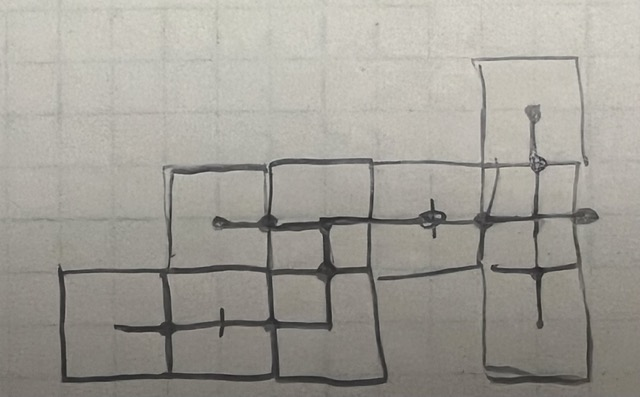
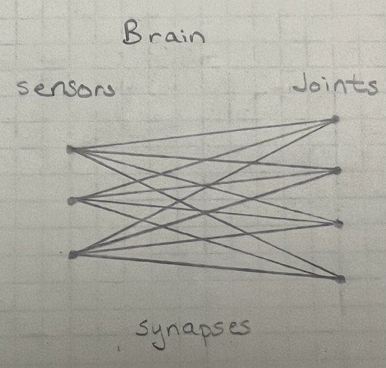
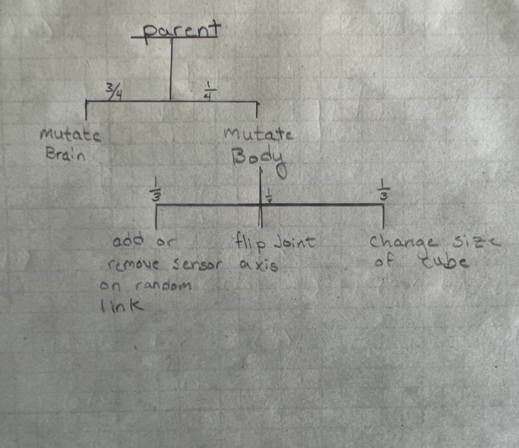
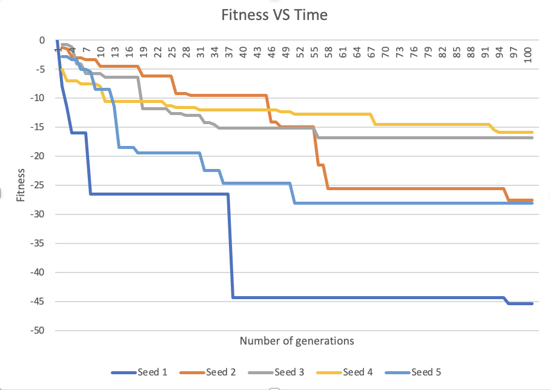

## Assignment 8

#### Running the code
Inorder to run this code first please clone the repository and enter the assignment8 branch. Then run main.py which will install the requirements and then run the search algorithm. The current search is set to run for 1 generation with a population size of 1 and have a maximum number of links of 10 with a max size being 1 and a min being .01 but this can be reconfigured in constants.py

#### Project info 
This project is part of CS 396-Artificial life at Northwestern Universiy. It began as a Ludobots project which is a reddit course that can be found [here](https://www.reddit.com/r/ludobots/) and uses pyrosim physics simulator to make the world environment and determine the interactions in the world. 

#### Assignment info 
This assignment was to create a 3D  creature. Green boxes denote sensors and blue denotes sensorless boxes. These creatures and brains were then evolved using a parallel hill climber algorithm 

#### Body Generation 
For this assignment, we created a body in 3 dimensions which randomly branched in all directions. The way that this was accomplished was by first making a single root node. This node was then used as a parent node and children were added in random directions. Each direction was weighted evenly. Each of these nodes could also have either 1, 2 or 3 children however the probability of having 1 child was much larger than either 2 or three. An example two dimensional body can be seen below. 

In this diagram the lines show the parent child connections, however, it must be noted that in the simulation each of the blocks are random sizes. it shoudl also be seen that this diagram is only in 2 dimensions however the simulation does this in 3 dimensions. 

#### Brain Generation 
The simulation also generates a brain to opperate the robot. To do this each element of the body has a 50% chance of becoming a sensor if the element is a sensor it is then connected to each of the joints by a synapse with a random weight. An example brain is shown below. 

 

The dots on the left represent sensors and the ones on the right are all the joins in the robot. The lines running between them are synapses with random weights. 

#### Mutation

The final step that needed to be done in this assignment was mutating the brain and the body. The way this is done is detailed in the diagram below. Things to note here are that the mutations that can occur are brain mutations of the synaptice weights, or body mutations whcih included adding or removing a sensor on a node, changing the joint axis connecting to nodes or scaling a block by a random size from 0-2 times the original. The probabilities for each of these events are shown on the graph below as fractions.

#### Results

Finally this ismulation was run 5 times each with different seeds 1,2,3,4,5 fo r100 generations with generation sizes of 10. The best fitness from each generation was recorded and plotted. The plot is below: 

