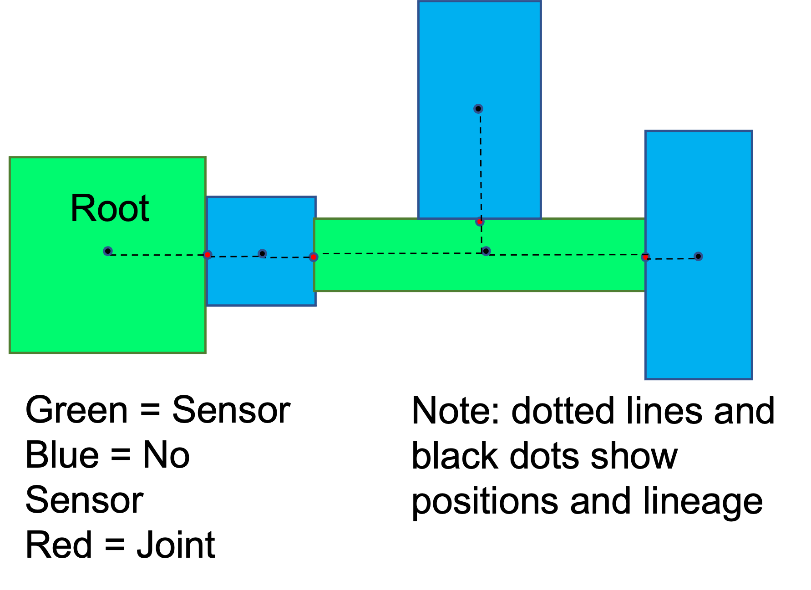
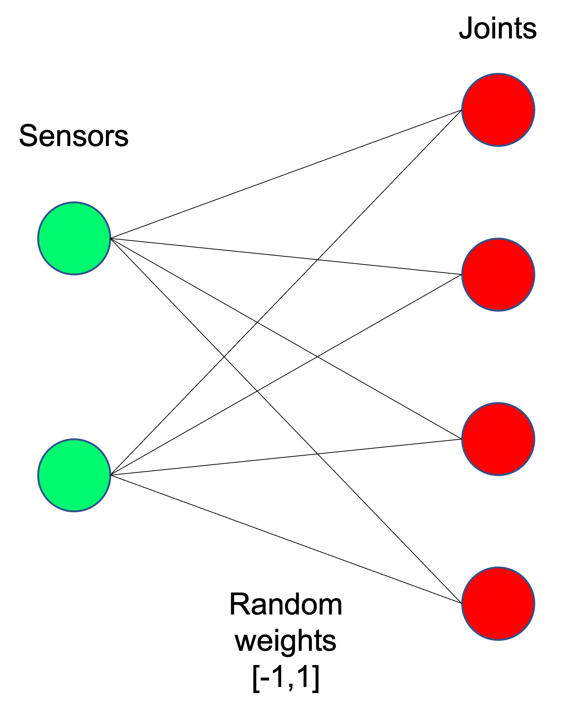
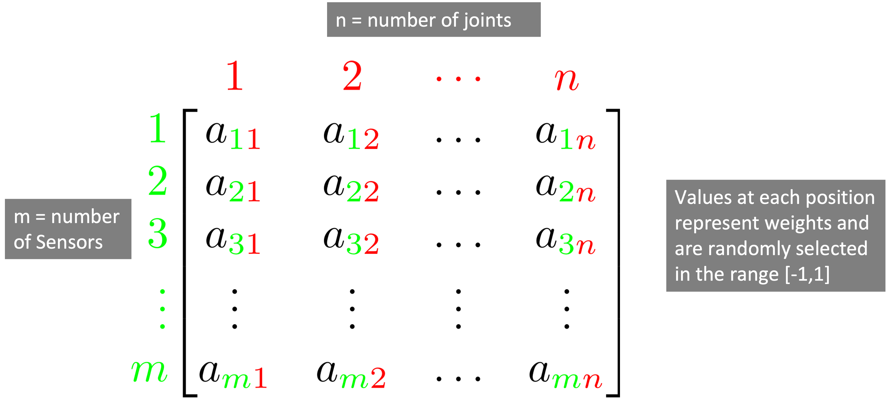
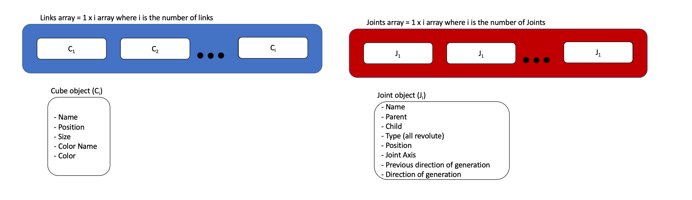
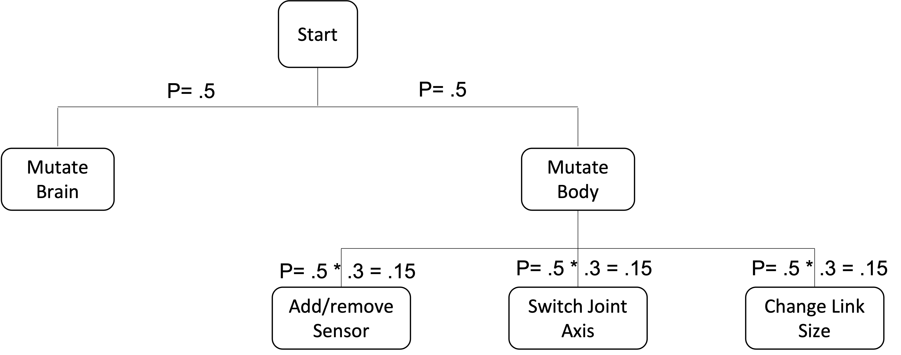
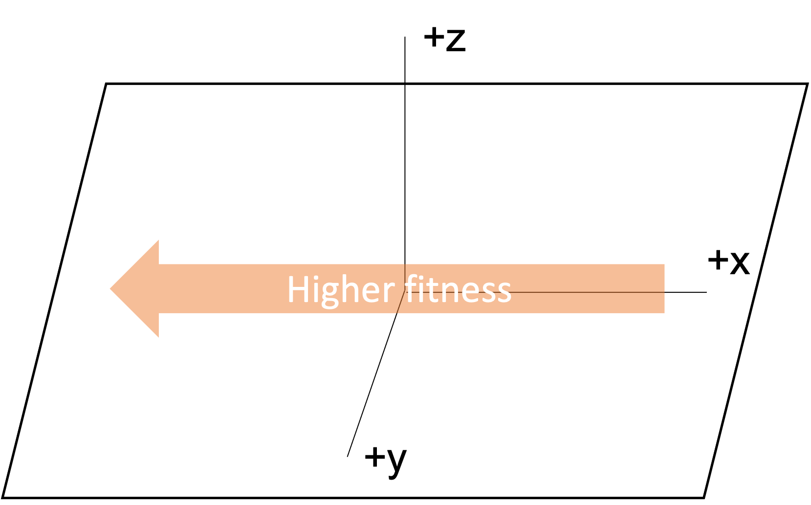
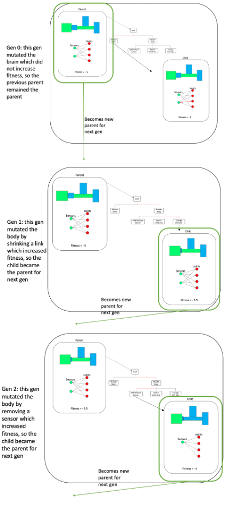
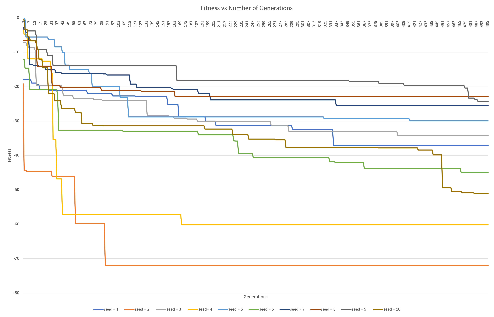

## Final project- The engineer route- 14 pts

#### Running the code
Inorder to run this code first please clone the repository and enter the FinalProject branch. Then run main.py which will install the requirements and then run the search algorithm. The current search is set to run for 1 generation with a population size of 1 and have a maximum number of links of 10 with a max size being 1 and a min being .01 but this can be reconfigured in constants.py. Each run is also deterministic and can be configured to get different results based on the current seed. Becuase of this, the only thing needed to recreate and store robots is the seed, so to get results that match my favorite robot in constants.py the seed should be set to 1 population size to 1 and number of generations to 500.
#### Project info 

This project is part of CS 396-Artificial life at Northwestern Universiy. It began as a Ludobots project which is a reddit course that can be found [here](https://www.reddit.com/r/ludobots/) and uses pyrosim physics simulator to make the world environment and determine the interactions in the world. 

#### Overview 
This assignment was to create a 3D  creature. Green boxes denote sensors and blue denotes sensorless boxes. These creatures and brains were then evolved using a parallel hill climber algorithm. More on all of this to come.  

#### Body Generation 
For this assignment, we created a body in 3 dimensions which randomly branched in all directions. The way that this was accomplished was by first making a single root node. This node was then used as a parent node and children were added in random directions. Each direction was weighted evenly. Each of these nodes could also have either 1, 2 or 3 children however the probability of having 1 child was much larger than either 2 or 3. An example two dimensional body can be seen below. 

In this diagram the lines show the parent child connections, red circles show the joints between the blocks and blue or green block are links with either sensors or no sensors as mentioned above. Pleane note that the diagram is also in 2 dimensions but in the simlation this is done it 3 dimensions. This was done for simplicity of drawing. The code to make these bodies can be found in the links class which makes the genotype for the brain and body 

#### Brain Generation 
The simulation also generates a brain to opperate the robot. To do this each element of the body has a 50% chance of becoming a sensor if the element is a sensor it is then connected to each of the joints by a synapse with a random weight ranging from -1 to 1. An example brain is shown below. 

The dots on the left represent sensors and the ones on the right are all the joins in the robot. The lines running between them are synapses with random weights. 
#### Genotype and storage of the brain and body 

The brain was stored in a n x m array which can be seen below:

Athoguh this was how it was stored in the computer, a graph will be used as a visual representation

The body was stored in a two arrays. One 1 x i array where i is the number of cubes called links and another 1 x j array called joints where j is the number of joints. These two arrays contained all the information that was needed to make the body. 

#### Mutation

The final step that needed to be done in this assignment was mutating the brain and the body. The way this is done is detailed in the diagram below. Things to note here are that the mutations that can occur are brain mutations of a synaptic weight, or body mutations whcih included adding or removing a sensor on a node, changing the joint axis connecting to nodes or scaling a block by a random size from 0-2 times the original. The probabilities for each of these events are shown on the graph below as fractions.

This is done in solution.py in the mutate method. 

#### Fitness 

To determine fitness of the creatuures the distance traveled in the -x direction was tracked. This means that a more negative fitness is actually better. A diagram of this is shown below 

#### Example evolutionary run- prallel hill climber

 The digram below walks through a simplified evolutionary run with population size of 1 and number of generations set to 3. This diagram shows the parent, the mutation and the resulting child as well as the fitness of both of them. This digram also shows the hill climber algorithm which is when the parent and child compare fitnesses and the one with a better fitness becomes the parent for the next run of evolution.  To make this into a parallel hill climber you can just imagine that there are multiple rows of the same thing happening simultaniously but the rows do not intereact. 
 
 

#### Results

Finally this smulation was run 10 times each with different seeds 1-10 for 500 generations with population sizes of 10. The best fitness from each generation was recorded and plotted. The plot is below: 

#### Discussion

As you can se in the plot above the fitnesses ranged form the best at -72 to the worst at -22 (lower fitness = better). Some things that I noticed were that smaller creatures and creatures with fewer links tended to perform better. This could be becuase of be motors have a predetermined strenght so as they grew the strength stayed constant and they could no longer move their bodies effectivly, althoguh this needs further testign to be sure. Another thing that I noticed was that most creatures started out increasing at a very fast rate but then woudl get stuck and very few large jumps would happen after about 200 generations. This is probably because at that point in evoltion only very small mutations woudl increase the fitness and anything larger would decreas it. This owudl result in fewer mutations and fitness increases becuase large and small mutations are equally likely. 

